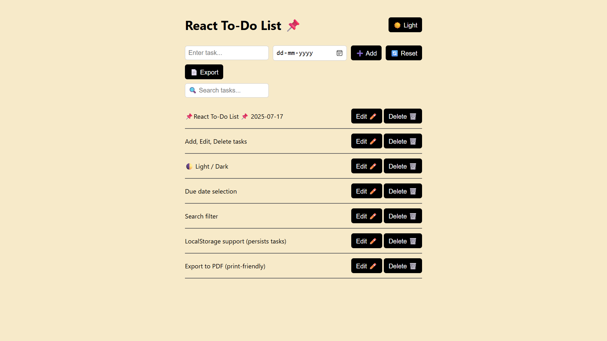
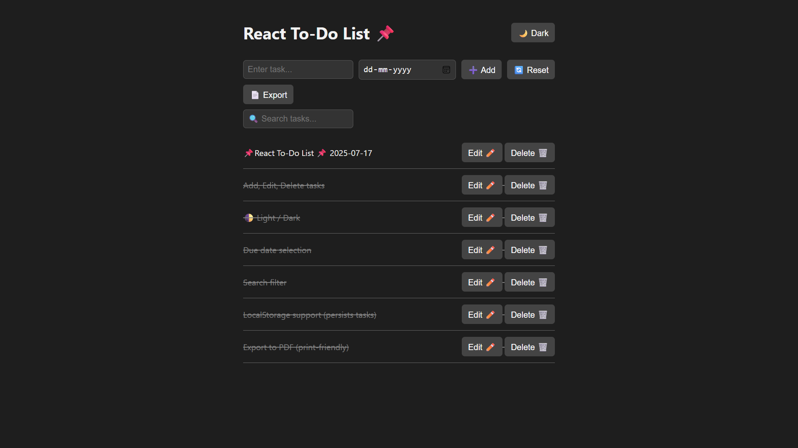
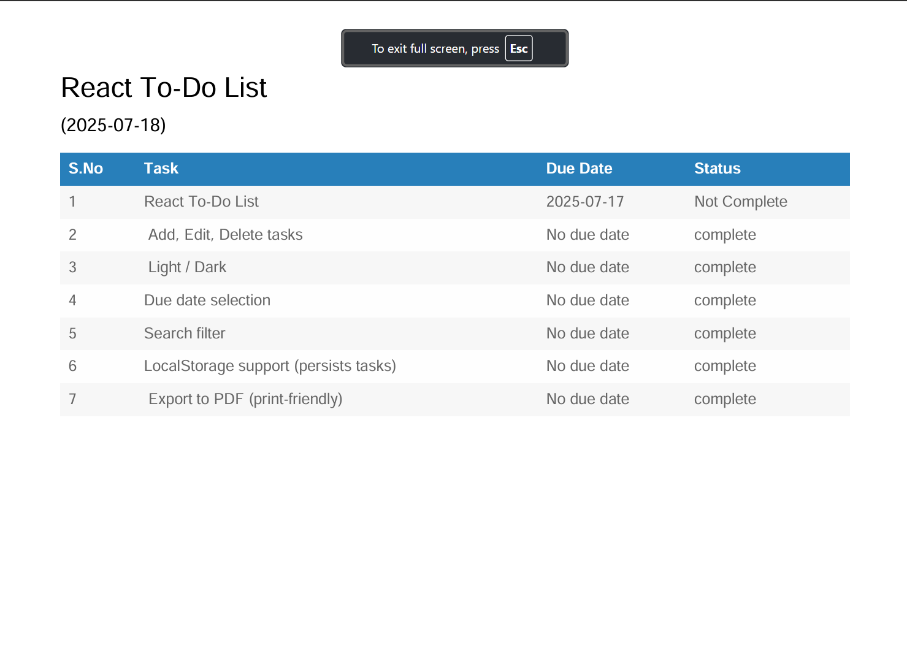

# 📝 React To-Do List App

A fully functional and beautiful **To-Do List** web app built with **React**, supporting local storage, theme toggle, search, export to PDF, and animations.

## 🚀 Features

- ✅ Add, edit, delete, reset tasks
- ✅ Mark tasks as completed (with strike-through)
- ✅ Date input for task deadlines
- ✅ Search filter for tasks
- ✅ Dark / Light theme toggle with persistence 🌙☀️
- ✅ Export task list as a PDF 📄
- ✅ Smooth animations when adding/removing tasks
- ✅ Mobile responsive

---

## 📸 Screenshot





---

## 🔧 Installation & Running

1. **Clone the repo**:

```bash
git clone https://github.com/0SAKESH0/todo-react.git
cd todo-react
